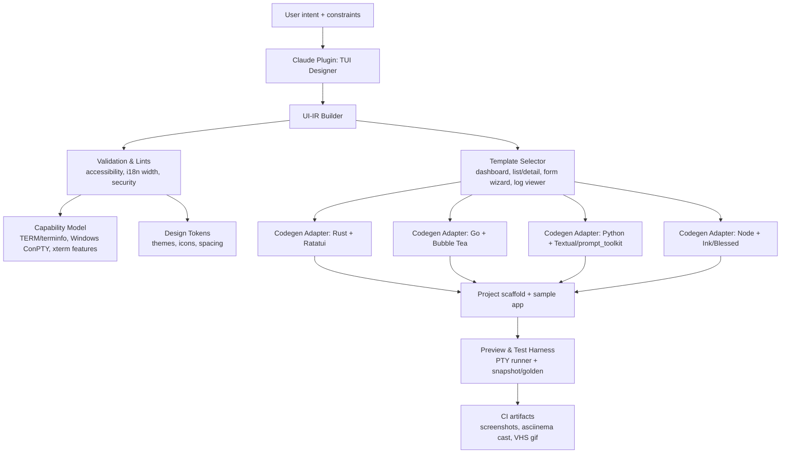
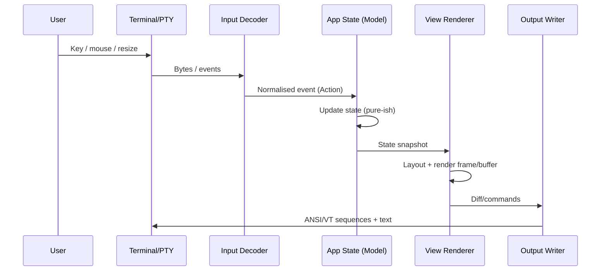

# What Makes a Professional Terminal UI and How to Encode It into a Claude TUI-Design Plugin

## Executive summary

Professional TUIs feel “awesome” when they combine (a) predictable interaction patterns (keyboard-first, consistent focus rules, discoverable help), (b) high information density without clutter (clear hierarchy, stable layouts, meaningful colour), and (c) engineering discipline (fast redraws, robust terminal compatibility, safe handling of untrusted text, and testable architecture). Mature ecosystems reach these goals through a small set of recurring ideas: modelling terminals as character-cell “screens” driven by capability databases (terminfo/ncurses), diff-based or buffered rendering to reduce flicker, and explicit event loops that separate input → state update → view rendering. citeturn15search0turn13search0turn0search2turn0search5turn2search38

For a Claude plugin that *designs* TUIs (not just generates code), the highest leverage is to standardise a **UI intermediate representation (UI-IR)** with: layout primitives (rows/cols/flex/grid), canonical components (list, table, tree, form, log, modal, help bar), interaction semantics (focus, keymaps, mouse, shortcuts), theming tokens, accessibility constraints, and a portability layer for terminal capabilities and widths. This lets you emit high-quality skeletons into multiple stacks (e.g., Rust+Ratatui, Go+Bubble Tea, Python+Textual/prompt_toolkit, Node+Ink/Blessed) while keeping one consistent “design brain”. citeturn0search2turn0search5turn2search4turn1search0turn15search0

Because user constraints are unspecified (target users, performance budgets, supported languages), the plugin should surface explicit knobs and sensible defaults: (1) choose environment (local terminal/SSH, Windows/WSL, CI/non-interactive, web terminal), (2) choose ergonomics style (Vim-like, Emacs-like, “app-like”), (3) choose accessibility strictness (contrast targets, colour-blind-safe palette, reduced motion), (4) choose performance envelope (low CPU vs smooth animations), and (5) choose language/library output(s). citeturn4search0turn5search0turn3search3turn0search13turn2search4

## TUI ecosystem and library landscape

### The “layers” of a TUI, and why they matter

Most TUIs sit on several layers that shape design constraints:

1. **Terminal capability discovery and control sequences.** Traditional portability relies on a terminal capability database (terminfo) describing how to move the cursor, clear regions, enter alternate screen buffers, etc. Terminfo is explicitly described as a database used by screen-oriented programs and curses libraries. citeturn13search0turn0search0turn0search20  
2. **Screen and input abstraction.** Libraries like ncurses provide terminal-independent screen updates and input handling, and optimise output by computing minimal updates between refreshes (a key foundation for “smooth” TUIs). citeturn15search0turn15search17  
3. **Application architecture.** Many modern frameworks explicitly formalise an event loop: e.g., Bubble Tea’s Model–Update–View (MVU) and Ratatui’s immediate-mode draw cycle with intermediate buffers. citeturn0search2turn0search5  
4. **Widgets vs primitives.** Some stacks provide rich widget toolkits (tview, prompt_toolkit, Urwid, Textual), while others give lower-level primitives (termbox, notcurses, crossterm) and expect you to build components yourself. citeturn1search7turn0search3turn2search6turn2search4turn8search28

A Claude “TUI design” plugin should treat these layers as explicit design axes: portability vs control, widget richness vs minimalism, rendering strategy (diffing/retained), and ecosystem maturity.

### Languages and frameworks: practical trade-offs for TUIs

**C / C++ (ncurses, notcurses, bespoke renderers).**  
Curses/ncurses remains the “classic” approach: terminal-independent screen updates with optimisation and terminfo integration. citeturn15search0turn13search0  
Notcurses positions itself as a “next-generation” C library for complex TUIs, aiming to exploit modern terminal features (colour, Unicode, multimedia) beyond ncurses compatibility. citeturn2search3turn2search11  
Trade-off: maximum control and low overhead, but higher development cost, more manual safety work, and less “batteries-included” UI composition compared with higher-level frameworks.

**Rust (Ratatui, crossterm, others).**  
Ratatui’s core model is immediate rendering with intermediate buffers; it describes itself as immediate-mode rather than retained-mode. citeturn0search5turn0search33  
Ratatui also highlights a double-buffer/diff approach to keep rendering fast. citeturn0search13turn0search9  
Crossterm provides cross-platform terminal manipulation and events (keyboard/mouse/resize), but requires careful raw-mode management. citeturn8search3turn8search9turn8search28  
Trade-off: excellent performance and safety + good ecosystem patterns; slightly steeper learning curve; still need to handle terminal edge cases (widths, capabilities) explicitly.

**Go (Bubble Tea, tcell/tview, gocui).**  
Bubble Tea formalises MVU (Init/Update/View), which is well-suited to testability and predictable state changes. citeturn0search2turn0search6  
The Charm ecosystem provides reusable components (“Bubbles”). citeturn0search30  
tcell is a cell-based terminal abstraction inspired by termbox with “many additional improvements,” and tview builds rich widgets on top of tcell (lists, forms, tables, layouts). citeturn1search15turn1search7turn6search4  
Lazygit explicitly wraps gocui in its GUI layer (confirming its low-level widget/panel style). citeturn7search15turn7search5  
Trade-off: strong distribution story (static binaries common), great for ops tooling; library choices split between “framework” (Bubble Tea) and “widget toolkit” (tview) with different mental models.

**Python (prompt_toolkit, Rich, Textual, Urwid, blessed).**  
prompt_toolkit supports both REPL-style and full-screen apps using layouts, styles, and key bindings (including default keybindings and filterable activation). citeturn12search4turn0search3turn0search11  
Rich focuses on rich text formatting and renderables like progress bars/tables; its Progress supports auto-refresh and configurable refresh rate. citeturn2search9turn2search5  
Textual is a higher-level framework with widgets, reactive attributes, and an asyncio-based concurrency model (widgets run in their own asyncio task). citeturn12search1turn2search4turn2search0  
Urwid is a long-standing console UI library that composes widgets into canvases and manages rendering via a main loop. citeturn2search6turn2search38turn2search10  
Python “blessed” is a terminal capability wrapper that emphasises easy colours/positioning and keyboard input. citeturn1search5turn1search17  
Trade-off: fastest iteration and great ergonomics; performance depends on workload; careful width/i18n handling needed; packaging and distribution differ from single-binary approaches (Textual has explicit packaging guidance). citeturn12search37turn5search26

**Node.js (Ink, blessed (+ contrib forks)).**  
Ink describes itself as React for CLI and uses Yoga/Flexbox layout in the terminal. citeturn1search0turn13search4  
blessed (Node) provides a curses-like high-level API; community notes list it as “no longer maintained,” and its npm listing shows historical stagnation. citeturn1search33turn1search1  
blessed-contrib builds dashboards/widgets (charts, gauges) on top of blessed. citeturn12search2  
Trade-off: excellent developer familiarity (React mental model) and fast UI composition; runtime footprint and ecosystem churn; terminal compatibility can be trickier for deep/full-screen behaviours vs native stacks.

### Comparison table: popular libraries and their trade-offs

| Library / stack | Language | Level | Rendering / architecture | Strengths | Common pitfalls | Primary sources |
|---|---|---|---|---|---|---|
| ncurses | C | Screen + input abstraction | Optimised screen updates, terminfo-backed portability | Extremely mature portability model; optimises minimal updates; handles mouse/keyboard | Complex API; terminfo and terminal quirks; C safety burden | citeturn15search0turn13search0turn0search0 |
| termbox (original) | C | Minimal cell grid | “Table of fixed-size cells” + event stream | Small API, easy mental model | Copy/paste and wide characters are sensitive/problematic by design | citeturn1search34 |
| termbox2 | C | Minimal + batteries | Slim alternative; built-in support when terminfo DB absent | Helps in minimal/container/embedded environments | Still a minimal abstraction; you build widgets yourself | citeturn1search14 |
| tcell + tview | Go | tcell: cell grid, tview: widgets | Widget toolkit with mouse/unicode sections | Rich widgets (lists/forms/tables); good ops-tool fit | Widget composition & focus rules can become complex; theming less structured than CSS-like systems | citeturn1search15turn1search7turn6search4turn6search13 |
| Bubble Tea (+ Bubbles) | Go | App framework | MVU: Init/Update/View | Predictable, testable architecture; component ecosystem | Requires disciplined state design; rendering performance depends on view complexity | citeturn0search2turn0search6turn0search30 |
| Ratatui (+ crossterm backend) | Rust | Widget library | Immediate-mode render + intermediate buffers; diff-based updates | Good performance patterns; ergonomic widgets; explicit draw cycle | App must redraw “whole frame”; you manage event loop + timing carefully | citeturn0search5turn0search13turn8search3turn8search9 |
| prompt_toolkit | Python | Framework (REPL + full-screen) | Layout + keybindings + styles; widgets | Excellent input editing, keybinding system, full-screen widgets | Complexity for large apps; careful async integration | citeturn0search3turn0search11turn12search4 |
| Rich | Python | Renderables toolkit | Auto-refresh renderables (e.g., Progress) | Beautiful tables/progress/tracebacks quickly | Full-screen “app” architecture isn’t its primary focus | citeturn2search9turn2search5 |
| Textual | Python | App framework | Widget/event system + reactive attrs; asyncio tasks | Modern UI model, CSS-like styling; built-in examples & packaging docs | Requires learning framework conventions; async correctness | citeturn12search1turn2search4turn12search5turn2search0 |
| Urwid | Python | Widget toolkit | Widget → canvas rendering + main loop | Proven widget model; fluid resizing; extendable components | Older aesthetic by default; width edge cases still matter | citeturn2search6turn2search38turn2search14 |
| Ink | Node | Framework | React renderer + Yoga/Flexbox | Familiar React patterns, Flexbox-like layout | Node toolchain/runtime; terminal edge cases across emulators | citeturn1search0turn13search4 |
| blessed + blessed-contrib | Node | Widget toolkit | DOM-like elements/widgets | Fast dashboard prototyping; ready widgets | Maintenance risk in original blessed; compatibility forks vary | citeturn1search33turn1search1turn12search2 |

**Actionable recommendation for the Claude plugin:** implement a “library selector” that asks for: (1) app type (dashboard vs editor vs list/detail), (2) target environments (SSH/Windows/web), (3) desired layout model (Flexbox/CSS-like vs grid/panes), and (4) complexity ceiling. Use that to recommend 1–3 stacks and generate a matching starter template. The table above should be encoded as machine-readable rules.

## Interaction design patterns and components

### Professional layout patterns: what shows up in exemplary TUIs

Across successful open-source TUIs, several patterns recur because they work well in character-cell UIs:

**Two- or three-pane “workbench” layouts.** Common in tools that navigate and act (file managers, git clients, cluster dashboards): left navigation/list, centre main content (diff/table), optional right details/preview. This pattern is explicit in tools like entity["local_business","Lazygit","open-source git tui"] (multi-panel git workflows) and entity["local_business","K9s","kubernetes tui"] (table views, customisable columns). citeturn7search3turn6search27turn7search0  

**Persistent help / key-hint bars.** Users stay productive when commands are visible at the bottom/top, and change contextually with focus (a hallmark of Bubble Tea components that advertise auto-generated help, and of many “panel” TUIs). citeturn0search30turn7search6  

**Command palette / fuzzy find overlays.** A modal overlay (or “mini-buffer”) reduces cognitive load: keep primary layout stable, but provide fast navigation and actions. (Bubbles’ list component highlights fuzzy filtering and status/help patterns.) citeturn0search30turn0search10  

**Modal dialogs for rare/unsafe actions.** Confirmation modals (delete, apply, destructive operations) and form-like prompts reduce accidental triggers; they also provide clear keyboard focus management (Tab/Shift-Tab). prompt_toolkit’s widget and keybinding system is explicitly designed around composing widgets and bindings. citeturn0search3turn0search7  

**Tables and trees for exploration.** Tables are dominant in ops dashboards (pods, processes). Trees are essential for hierarchical data (process trees, nav). For example, htop’s man page describes mouse interaction and tree format. citeturn10search29turn10search4  

image_group{"layout":"carousel","aspect_ratio":"16:9","query":["Lazygit terminal UI screenshot","K9s Kubernetes terminal UI screenshot","htop screenshot terminal","Textual Python TUI screenshot"],"num_per_query":1}

### Component trade-offs table: components vs cost

| Component | Why it makes TUIs feel “professional” | Trade-offs / failure modes | Implementation notes for the plugin |
|---|---|---|---|
| Pane(s) + focus ring | Enables dense information + clear “where am I” | Focus bugs; accidental key routing | Encode a focus manager + “active border” token; generate per-library focus wiring |
| Table with sorting/filter | Fast scanning; supports power users | Wide-char alignment; horizontal scroll UX | Require width engine (wcwidth/EAW); include column config + overflow rules |
| Tree view | Natural hierarchy (resources, directories) | Indentation wastes space; large trees need virtualisation | Provide lazy loading + incremental rendering hooks |
| Log viewer | Essential for long-running tools; tail + search | Terminal injection risk from untrusted logs | Default sanitise control sequences (CWE-150 mitigation) |
| Form wizard | Structured data entry; prevents errors | Slow if overused; needs validation UX | Provide schema-driven forms + inline validation states |
| Progress + spinners | Perceived responsiveness; async feedback | High refresh can burn CPU; flicker if naive | Provide refresh policy presets (10Hz default; cap in SSH) |
| Help overlay | Discoverability; reduces training cost | Can be noisy if always visible | Support context-sensitive help with “?” toggle |
| Command palette | Power navigation/actions | Hard to design good ranking | Provide fuzzy match + command metadata schema |

This table is intentionally “design-first”: the plugin should generate these as **templates/presets**, not bespoke code each time.

### Keyboard and mouse interactions: best practices grounded in terminal reality

**Keyboard-first is non-negotiable, but mouse support is a differentiator when done safely.**  
Many terminal stacks explicitly support mouse events, but they may require opt-in enabling. For instance, crossterm requires enabling mouse capture and focus change events via commands; otherwise mouse/focus events are not enabled. citeturn8search3  
On the terminal protocol side, mouse tracking is historically tied to xterm/VT-style sequences (DECSET 1000/1002/1003 etc.). citeturn3search2turn3search34turn3search10  

**Keybinding systems should be (a) discoverable, (b) remappable, (c) context-aware.**  
prompt_toolkit’s key binding system is designed for merging bindings and enabling/disabling via filters. citeturn0search11  
Bubble Tea’s MVU encourages modelling key events in Update and rendering help in View, and Bubbles components emphasise built-in help and key hints. citeturn0search2turn0search30  

**Professional ergonomics patterns:**  
A practical default set that the plugin can encode as presets:

- “Quit safety”: `q` in navigational contexts, `Esc` to close modals, `Ctrl+C` always quits. Bubble Tea examples and tutorials commonly map quit to `q`/`ctrl+c`. citeturn0search6turn0search2  
- Vim-like navigation as optional: `j/k`, `g/G`, `/` search, `n/N`. (Many TUIs emulate this even if not explicitly documented.)  
- Tab order: `Tab` next, `Shift+Tab` previous; supported naturally in prompt_toolkit focus bindings. citeturn0search7  
- Mouse as “assist”, not dependency: click-to-focus/select, scroll in lists/tables, but ensure every action is possible from keyboard.

**Actionable recommendation for the Claude plugin:** include a **Keymap DSL** with named actions (e.g. `action.quit`, `action.open`, `action.filter`, `action.toggle_help`) instead of binding directly to key strokes. Then generate per-library bindings and an auto-generated help panel. This aligns with prompt_toolkit’s binding composition and Bubble Tea’s MVU-style command handling. citeturn0search11turn0search2

### Concrete exemplary TUIs to study (repos)

The following open-source TUIs are consistently useful references for “professional feel” patterns (layout, discoverability, config, stability):

| Repo | What to study | Evidence / source |
|---|---|---|
| entity["local_business","Lazygit","open-source git tui"] | Panel layout, key-driven workflows, custom commands/config | citeturn7search3turn7search15 |
| entity["local_business","K9s","kubernetes tui"] | Table-first data exploration; column customisation; fast navigation | citeturn6search27turn7search0 |
| entity["local_business","htop","interactive process viewer"] | Dense process table + tree, mouse support, config UI | citeturn10search4turn10search29turn10search0 |
| entity["local_business","Tig","git tui"] | Diff/log browsing, pager mode behaviour | citeturn10search7turn10search24 |
| entity["local_business","tmux","terminal multiplexer"] | Pane management, composability, key tables and prefix model | citeturn10search12turn10search5 |
| entity["local_business","Midnight Commander","text-mode file manager"] | Two-pane file-manager UX, classic “orthodox” layout | citeturn10search2turn10search6 |
| entity["local_business","bottom","terminal system monitor"] | Modern charts/graphs in terminal, heavy customisation | citeturn11search1 |
| entity["local_business","Yazi","terminal file manager"] | Responsiveness via async I/O; modern visuals; previews | citeturn11search2turn11search15 |
| entity["local_business","Zellij","terminal workspace"] | Plugin architecture, layout management, UX defaults | citeturn11search3turn11search19turn11search6 |
| entity["local_business","Textual","python tui framework"] | Modern widget model + theming + testing framework claims | citeturn12search1turn12search5 |
| entity["local_business","ptpython","python repl"] | Advanced keybindings, REPL UX patterns | citeturn12search0turn12search36 |
| entity["local_business","ranger","console file manager"] | Vim-like navigation, previews, minimal visuals | citeturn12search3turn12search11turn12search35 |

## Visual design, colour, typography, and accessibility

### Colour in terminals: constraints and best practices

**Terminals are not a “pixel canvas”; your palette is partially out of your control.**  
Terminal colour capabilities span 16-colour, 256-colour, and “truecolour” (24-bit) modes, but actual palettes may vary by emulator/theme. That variability is a reason to design around *semantic tokens* rather than hard-coded RGB for core states. (Even general references note that 256-colour lookups vary across implementations.) citeturn4search10turn13search0

**Best practices that translate to a Claude design plugin:**

- **Token-based theming.** Define `fg.default`, `fg.muted`, `fg.danger`, `bg.panel`, `border.focused`, etc. Emit the closest representation per library (e.g., Ratatui `Style`, prompt_toolkit `Style`, Textual CSS-like). Ratatui-based projects often serialise themes and update formats (GitUI release notes discuss colour serialisation changes and hex support). citeturn11search7turn0search5turn0search33  
- **Support both dark and light modes** as first-class themes, and allow runtime switching (where supported).  
- **Use colour sparingly for state and hierarchy**, not decoration: selection, focus, warnings, active tab, diff additions/deletions.  
- **Include non-colour cues for accessibility and robustness:** icons (ASCII fallbacks), bracket markers, emphasis via bold/underline (noting terminals vary in how they render “bold”). citeturn15search0turn4search10  
- **Provide “low-colour” fallback mode** (16 colours) and “no-colour” mode. The NO_COLOR specification explicitly defines a convention to suppress colour in terminal output. citeturn13search20

### Accessibility: contrast and colour blindness in a TUI context

Terminal apps are not web pages, but contrast principles still apply: if users can’t read it, it’s not “professional.” WCAG 2.2 defines contrast ratios such as 4.5:1 for normal text (AA) and 7:1 for enhanced contrast (AAA). citeturn4search0turn4search1  

**How to apply this in TUIs (actionable, not theoretical):**

- **Contrast targets as “design constraints” in the plugin.** Let users choose: “AA-like” (≥4.5:1 for normal text) vs “AAA-like” (≥7:1) mapping to palette generation. citeturn4search1turn4search0  
- **Avoid encoding meaning purely in hue.** Provide shape/label differences (e.g., `!` for warnings, `×` for errors), because colour vision deficiency can erase red/green distinctions. citeturn4search4  
- **Offer a “reduced motion” mode** by default when rendering animations/spinners (see performance section); expose this as a plugin-level token (“prefers reduced motion”) even if terminals don’t signal it.

### Typography and monospace: what a TUI can and cannot control

TUIs cannot choose the user’s terminal font, but they *can* choose which Unicode characters to emit—and that is where professionalism is won or lost.

**Width correctness is foundational.**  
Terminal UIs rely on cell widths, but Unicode contains wide characters (CJK), combining marks, and ambiguous-width characters. Unicode Standard Annex #11 defines East Asian Width categories and their use for width-sensitive processing. citeturn5search0turn5search4  
POSIX defines `wcwidth()` to determine the number of column positions required for a wide character, and libraries like `wcwidth` in Python implement these semantics for terminal display. citeturn5search26turn5search2  
This matters directly for tables, alignment, truncation, and cursor positioning.

**RTL and bidirectional text.**  
If your TUI ever displays Arabic/Hebrew mixed with LTR content, you enter bidi territory; Unicode UAX #9 defines the Bidirectional Algorithm. citeturn5search1  
Terminals vary widely in bidi support, but the plugin should at minimum support correct string measurement and provide an “RTL-aware” rendering strategy option.

**Icons and “modern look.”**  
Many TUIs use patched fonts (Powerline/Nerd Fonts) to get icons; Nerd Fonts explicitly patches developer fonts to add many glyphs/icons. citeturn5search3turn5search7  
However, professional TUIs must degrade gracefully when glyphs are missing: the plugin should provide an icon registry with ASCII fallbacks.

**Actionable recommendation for the Claude plugin:** provide a built-in “text metrics” module in the UI-IR toolchain:

- `display_width(s)`, `truncate_ellipsis(s, max_cells)`, `pad_to(s, width_cells)`  
- selectable rules for ambiguous-width characters (some terminals allow treating East Asian Ambiguous as wide). citeturn5search24turn5search0  
- bidi-aware layout strategy toggles (opt-in), grounded in UAX #9. citeturn5search1turn5search21

## Performance, rendering, and responsiveness

### Rendering models: why some TUIs feel “snappy” and others “laggy”

**Diff-based buffer rendering (common in terminal UI libs).**  
ncurses explicitly describes optimising output by computing a minimal volume of operations to mutate the screen between refreshes. citeturn15search0  
Ratatui describes immediate rendering with intermediate buffers and notes diff-based rendering (“double buffer technique that only renders diffs”). citeturn0search5turn0search13turn0search9  

**MVU / declarative update loops.**  
Bubble Tea codifies Init/Update/View; you render the view from model state after each update. citeturn0search2turn0search6  
This pattern tends to produce predictable performance because expensive work is easier to isolate—*if* you keep View cheap and avoid blocking Update.

**Retained widget trees + event loops.**  
Textual widgets run in their own asyncio tasks, implying a concurrency model that can keep UIs responsive if background work is scheduled correctly. citeturn2search4  
Urwid’s MainLoop ties together display, widgets, and an event loop, centralising scheduling and rendering. citeturn2search38turn2search6  
Rich’s Progress supports auto-refresh (refresh-per-second), which is helpful but must be tuned to avoid unnecessary redraws. citeturn2search5turn2search1

### Best practices for responsiveness (what to bake into templates)

**Avoid blocking the UI loop.**  
In the Ratatui ecosystem, templates explicitly separate tick rate (TPS) from frame rate (FPS), signalling the importance of decoupling state updates from rendering frequency. citeturn0search29turn0search13  
Similarly, Yazi explicitly emphasises non-blocking async I/O and multi-threading for responsiveness. citeturn11search2turn11search15  

**Use “event-driven rendering” as a baseline, plus optional animation.**  
A professional default is: render on input/resizes; run background ticks at low TPS (e.g., 4–10) for spinners/time; cap FPS (e.g., 30–60) only when animations are active. The plugin should generate this policy explicitly per template.

**Backpressure and batching.**  
Terminals can be slow under remote links; diffing helps, but you must also batch writes and avoid high-frequency full-screen redraws. (ncurses design warns about frequent changes causing flicker/inefficiency and uses explicit refresh semantics.) citeturn15search0  

**Actionable recommendation for the Claude plugin:** ship “performance presets” as part of UI-IR compilation:

- `ssh_safe`: 10 FPS max when animating, low TPS, no full-screen gradients  
- `local_default`: 30–60 FPS for animations, 10 TPS, truecolour allowed  
- `low_cpu`: render only on events; animations replaced with discrete steps.

## Compatibility, deployment, and security

### Compatibility and environments: terminals, SSH, Windows, containers, CI, web terminals

**Terminfo and `$TERM` remain central in Unix-like environments.**  
Terminfo is a database describing terminals and is used by curses applications; the man page also documents how ncurses searches terminfo locations and variables like `TERMINFO` / `TERMINFO_DIRS`. citeturn13search0turn0search0  
This means your TUI must respect `$TERM`, and your plugin templates should include “capability detection” and graceful fallbacks (e.g., if no alternate screen, avoid “full screen”).  

**SSH needs PTY allocation for full-screen TUIs.**  
The OpenBSD `ssh(1)` man page describes `-t` as forcing pseudo-terminal allocation, explicitly useful for “screen-based programs.” citeturn14search1  
The plugin should recommend/auto-detect when the user is in no-PTY contexts and provide a degraded mode (non-interactive output, or “press to open interactive UI”).

**Windows terminals and ConPTY.**  
Microsoft’s pseudoconsole APIs exist to host character-mode applications; CreatePseudoConsole streams UTF-8 text interleaved with virtual terminal sequences. citeturn3search3turn3search31turn3search19  
If your plugin emits code intended for Windows, it should prefer libraries with good Windows support and include guidance about ConPTY-era compatibility.

**Web terminals (xterm.js and similar).**  
xterm.js explicitly targets “terminal apps just work,” including curses-based apps and mouse events, and exposes accessibility features such as screen reader mode and minimum contrast ratio support. citeturn13search4turn13search1  
This matters because a Claude plugin can offer **web previews**: render TUIs in-browser using a PTY backend and xterm.js frontend, allowing design iteration without a local terminal.

**Modern terminal features & portability traps.**  
xterm control sequences remain the de facto reference for features like mouse tracking (DECSET 1000/1002/1003), focus reporting, bracketed paste (2004), and alternate screen buffer modes like 1049. citeturn3search2turn3search34turn3search10turn3search18  
In practice, your plugin should model features as “capabilities” and generate fallbacks.

### Security considerations: terminal injection, escape sequences, and safe output

**Terminal escape/control sequences are an injection surface.**  
MITRE CWE-150 defines “Improper Neutralization of Escape, Meta, or Control Sequences,” exactly matching terminal escape injection concerns. citeturn3search0  
Real-world vulnerabilities include ANSI escape injection in logging frameworks (e.g., CVE notes for tracing-subscriber; IBM guidance mentions escaping ANSI control characters when output may be printed to terminals). citeturn3search4turn3search32turn3search20  

**Why this matters in a TUI designer plugin:**  
TUIs often display untrusted content: logs, git diffs, Kubernetes resource names, remote command output. If you render those bytes directly, an attacker can inject sequences that clear the screen, rewrite titles, create deceptive prompts, or abuse OSC features. citeturn3search0turn3search4  
This risk expands in “agentic” workflows: security research has shown ANSI codes can be used to deceive users in tool contexts (discussed in the context of MCP and terminal UX). citeturn3search36  

**Clipboard and hyperlink escape sequences.**  
OSC 52 can interact with clipboards (including over SSH), and terminals differ in support; this is powerful but also security-sensitive. citeturn3search1turn3search13turn3search21  
OSC 8 defines hyperlinks in supported terminals (documented by iTerm2 and tracked in adoption docs). citeturn9search4turn9search0turn9search8  

**Best-practice security mitigations the plugin should generate by default:**

- **Output sanitisation layer for untrusted text:** strip ESC (`\x1b`) and C0 control characters except newline/tab, or render them visibly (e.g., `␛`). This directly addresses CWE-150 class issues. citeturn3search0turn3search32  
- **Separate “trusted styling” from “untrusted content.”** Your view layer should compose styles around content, not allow content to contain raw terminal sequences.  
- **Explicit allowlist for OSC features** (clipboard/hyperlinks). Default: off; enable only if user opts in and terminal capability detection confirms support. citeturn3search1turn9search4turn9search8  
- **Bracketed paste as a safety UX feature.** Terminals can bracket paste input to distinguish paste vs typed input; xterm documents bracketed paste mode as a mechanism to avoid pasted text being interpreted as commands. citeturn13search10turn9search13turn3search18  

### Configurability, theming, extensibility, plugin architecture, testing/CI, i18n/RTL

These should not be “nice-to-haves”; they are what makes a TUI feel like a product rather than a script.

- **Configurability and theming:** K9s explicitly documents customising columns in table views; GitUI releases discuss theme file formats and colour specification. citeturn6search27turn11search7  
- **Extensibility and plugins:** Zellij provides a plugin model where plugins can be written in any language that compiles to WebAssembly and distributed as a single `.wasm`. citeturn11search19turn11search6  
- **Testing and CI:** robust TUI testing often involves pseudo-terminals (PTYs). Python’s standard library documents the `pty` module for launching subprocesses under a pseudo-terminal. citeturn8search5  
  For demo-driven regression tests, VHS records terminal interactions from scripts, and asciinema defines a structured recording format (newline-delimited JSON) for terminal sessions. citeturn8search0turn8search4turn8search1  
- **Internationalisation and RTL support:** Unicode defines East Asian Width (UAX #11) and the Bidirectional Algorithm (UAX #9); both inform correct rendering and layout in terminals. citeturn5search0turn5search1turn5search26  

## Plugin blueprint for Claude

### Design goals and non-goals

A “Claude TUI design plugin” should behave like a *compiler + scaffolder*:

- Input: intent + constraints (“Build an SSH-friendly dashboard with a left list and right details, with accessible colours and a safe log viewer”).  
- Output: UI-IR spec + code in selected language(s) + runnable template + test harness + theming/config system.

It should **not** hardcode a single library, because the ecosystem is fragmented and constraint-dependent (Windows vs Linux, web terminals, compiled vs scripting, widget-rich vs minimal). citeturn3search3turn13search4turn0search2turn12search1turn15search0

### Proposed UI-IR: the minimum viable schema that can generate professional TUIs

A practical IR should contain (at least):

- **Layout primitives:** `split(direction, ratio)`, `tabs`, `stack/pages`, `grid`, `scroll`.  
- **Components:** `List`, `Table`, `Tree`, `TextArea/Editor`, `LogView`, `Form`, `Progress`, `Modal`, `Toast`, `HelpBar`, `CommandPalette`.  
- **Interaction semantics:** focus graph, action routing, keymap/actions, mouse gestures, paste handling.  
- **Design tokens:** semantic colours, borders, spacing, typography flags (bold/underline), icon registry with fallbacks.  
- **Text metrics + i18n:** `display_width`, bidi mode, locale strings. citeturn5search26turn5search1turn5search0  
- **Capabilities:** alternate-screen, truecolour, mouse reporting, bracketed paste, OSC allowlist. citeturn3search2turn3search18turn9search4turn3search1  
- **Security policy:** sanitisation mode for untrusted content (CWE-150). citeturn3search0turn3search32  

### Architecture diagram: compiler-style plugin with adapters



This architecture explicitly encodes what the sources imply about the ecosystem (terminfo/terminal capabilities; frameworks that favour MVU vs immediate-mode vs widget trees; and the need for preview/testing infrastructure). citeturn13search0turn3search3turn0search2turn0search5turn8search4turn8search1

### Interaction flow diagram: event loop as a first-class concept



This diagram is deliberately compatible with Bubble Tea’s Update/View split and Ratatui’s draw cycle; it should be the conceptual backbone of your generated templates. citeturn0search2turn0search5turn15search0

### Prioritised feature list for the plugin

| Priority | Feature | Suggested default | Why it matters | Grounding / examples |
|---|---|---|---|---|
| P0 | UI-IR schema + validators | Enabled | Enables multi-language codegen + consistent UX quality | Ratatui immediate-mode requirements; Bubble Tea MVU model | citeturn0search5turn0search2 |
| P0 | Component templates (list/detail, dashboard, form wizard, log viewer) | 4–6 core templates | Professional feel comes from proven patterns, not ad-hoc layouts | tview widgets; prompt_toolkit widgets; Bubbles list features | citeturn1search7turn0search3turn0search30 |
| P0 | Keymap DSL (actions → bindings) + auto help | `?` toggles help; `q` quits | Discoverability + remapping are product-grade requirements | prompt_toolkit keybinding system; Bubble Tea MVU Update | citeturn0search11turn0search2 |
| P0 | Safe rendering / sanitisation module | Strip control sequences in untrusted content | Prevents terminal injection (CWE-150) and deceptive output | CWE-150; real-world ANSI injection CVEs | citeturn3search0turn3search4turn3search32 |
| P0 | Width engine + truncation/padding utilities | Use wcwidth/EAW tables | Tables/trees/forms break without correct cell width | POSIX wcwidth; Unicode UAX #11 | citeturn5search26turn5search0turn5search2 |
| P1 | Theme tokens + dark/light + high-contrast palette generator | Dark theme default; AA-like contrast | Modern look + accessibility; portability across colour depths | WCAG contrast criteria | citeturn4search1turn4search0turn13search20 |
| P1 | Capability detection and fallbacks | Detect $TERM/terminfo; disable fancy features when absent | SSH/containers/CI/web terminals differ; avoid broken UIs | terminfo DB; xterm sequences; xterm.js features | citeturn13search0turn3search2turn13search4 |
| P1 | Preview runner (local + web) | PTY preview; optional xterm.js web preview | Speeds design iteration; enables “visual” review in PRs | Python pty; xterm.js | citeturn8search5turn13search4 |
| P1 | Snapshot/golden testing | Record terminal frames; diff in CI | Prevents regressions in layout/keymaps | asciicast format; VHS scripting | citeturn8search1turn8search0turn8search4 |
| P2 | Plugin/extensibility scaffold | Provide hooks + examples | Lets apps grow without rewrites; aligns with modern expectations | Zellij WASM plugins concept | citeturn11search19turn11search6 |
| P2 | “Reduced motion” and low-CPU modes | Reduced motion on remote | Prevents CPU burn and flicker on slow terminals | ncurses refresh guidance; Ratatui FPS/TPS patterns | citeturn15search0turn0search29turn0search13 |
| P2 | Optional advanced terminal features (OSC 8 links, OSC 52 clipboard, images) | Off by default | Nice modern UX, but big compatibility/security surface | OSC 8 docs; OSC 52 discussion; kitty protocol specs | citeturn9search4turn3search1turn9search2 |

### Suggested defaults the plugin should emit

- **Default layout:** header (title + status), main split panes, footer help bar (toggleable).  
- **Default keymap:** `q`/`Ctrl+C` quit, `?` help, `/` search, `Tab` focus next, `Shift+Tab` focus prev; optionally `j/k` in lists. (This matches common MVU/full-screen patterns seen in frameworks and examples.) citeturn0search7turn0search2turn0search30  
- **Default rendering policy:** event-driven redraw + low-frequency tick (4–10 TPS) + capped animation FPS (30 local, 10 SSH). Use Ratatui-like FPS/TPS separation when applicable. citeturn0search29turn0search13  
- **Default safety:** sanitise untrusted text; disable OSC 52/OSC 8 unless explicitly enabled. citeturn3search0turn9search4turn3search1  
- **Default i18n stance:** UTF-8 on, correct width measurement using wcwidth/EAW; bidi support opt-in with clear limitations. citeturn5search26turn5search0turn5search1

### Sample code snippets in two representative languages

#### Rust example: Ratatui + Crossterm skeleton with safe text rendering

```rust
// Cargo.toml deps (indicative):
// ratatui = "0.29"
// crossterm = "0.28"

use std::io::{self, Stdout};
use std::time::{Duration, Instant};

use crossterm::{
    event::{self, Event, KeyCode, KeyEventKind},
    execute,
    terminal::{disable_raw_mode, enable_raw_mode, EnterAlternateScreen, LeaveAlternateScreen},
};

use ratatui::{
    backend::CrosstermBackend,
    layout::{Constraint, Direction, Layout},
    style::{Style},
    widgets::{Block, Borders, Paragraph},
    Terminal,
};

fn sanitize_for_terminal(s: &str) -> String {
    // Minimal, conservative sanitization: remove ESC and other control chars except \n and \t.
    // This mitigates CWE-150 style terminal escape injection risks for untrusted content.
    s.chars()
        .filter(|&ch| ch == '\n' || ch == '\t' || (ch >= ' ' && ch != '\u{7f}'))
        .collect()
}

fn setup_terminal() -> io::Result<Terminal<CrosstermBackend<Stdout>>> {
    enable_raw_mode()?;
    let mut stdout = io::stdout();
    execute!(stdout, EnterAlternateScreen)?;
    let backend = CrosstermBackend::new(stdout);
    Terminal::new(backend)
}

fn restore_terminal(mut terminal: Terminal<CrosstermBackend<Stdout>>) -> io::Result<()> {
    disable_raw_mode()?;
    execute!(terminal.backend_mut(), LeaveAlternateScreen)?;
    Ok(())
}

fn main() -> io::Result<()> {
    let mut terminal = setup_terminal()?;

    let mut should_quit = false;
    let mut status = String::from("Ready");
    let mut last_tick = Instant::now();

    // Rendering policy: event-driven + low-frequency tick.
    let tick_rate = Duration::from_millis(250);

    while !should_quit {
        terminal.draw(|f| {
            let area = f.size();

            let chunks = Layout::default()
                .direction(Direction::Vertical)
                .constraints([Constraint::Length(3), Constraint::Min(1), Constraint::Length(1)])
                .split(area);

            let header = Paragraph::new("My App")
                .block(Block::default().borders(Borders::ALL).title("Header"));
            f.render_widget(header, chunks[0]);

            let body_text = sanitize_for_terminal("Untrusted log line: \u{1b}[2J (would clear screen)");
            let body = Paragraph::new(body_text)
                .block(Block::default().borders(Borders::ALL).title("Body"))
                .style(Style::default());
            f.render_widget(body, chunks[1]);

            let footer = Paragraph::new(format!("Status: {status}  |  q/Ctrl+C quit  ? help"))
                .block(Block::default().borders(Borders::ALL).title("Help"));
            f.render_widget(footer, chunks[2]);
        })?;

        let timeout = tick_rate.saturating_sub(last_tick.elapsed());
        if event::poll(timeout)? {
            if let Event::Key(key) = event::read()? {
                if key.kind == KeyEventKind::Press {
                    match key.code {
                        KeyCode::Char('q') => should_quit = true,
                        KeyCode::Char('c') if key.modifiers.contains(crossterm::event::KeyModifiers::CONTROL) => should_quit = true,
                        _ => status = format!("Key: {:?}", key.code),
                    }
                }
            }
        }

        if last_tick.elapsed() >= tick_rate {
            last_tick = Instant::now();
        }
    }

    restore_terminal(terminal)
}
```

This snippet mirrors documented concepts: Ratatui’s immediate-mode draw cycle and buffering model, plus crossterm raw mode and event polling requirements. citeturn0search5turn8search3turn8search9turn0search13

#### Go example: Bubble Tea MVU starter with a reusable component mindset

```go
// go.mod deps (indicative):
// github.com/charmbracelet/bubbletea
// github.com/charmbracelet/bubbles (optional components)

package main

import (
	"fmt"
	"os"

	tea "github.com/charmbracelet/bubbletea"
)

type model struct {
	cursor int
	items  []string
	quit   bool
}

func (m model) Init() tea.Cmd { return nil }

// Update handles messages and updates state (MVU pattern).
func (m model) Update(msg tea.Msg) (tea.Model, tea.Cmd) {
	switch msg := msg.(type) {
	case tea.KeyMsg:
		switch msg.String() {
		case "ctrl+c", "q":
			m.quit = true
			return m, tea.Quit
		case "up", "k":
			if m.cursor > 0 {
				m.cursor--
			}
		case "down", "j":
			if m.cursor < len(m.items)-1 {
				m.cursor++
			}
		}
	}
	return m, nil
}

// View renders UI from state.
func (m model) View() string {
	if m.quit {
		return "Goodbye!\n"
	}

	s := "Select an item:\n\n"
	for i, it := range m.items {
		cursor := " " // no cursor
		if i == m.cursor {
			cursor = ">" // active row marker (non-colour cue)
		}
		s += fmt.Sprintf("%s %s\n", cursor, it)
	}
	s += "\nq quits • ↑/↓ or j/k moves\n"
	return s
}

func main() {
	m := model{items: []string{"Pods", "Deployments", "Services"}}
	if _, err := tea.NewProgram(m).Run(); err != nil {
		fmt.Println("error:", err)
		os.Exit(1)
	}
}
```

This expresses Bubble Tea’s documented Init/Update/View structure that makes TUIs predictable and testable. citeturn0search2turn0search6

### “Modern aesthetics” in terminals: minimal, sleek, and animated—without gimmicks

Modern TUIs often feel sleek when they use:

- **Whitespace and alignment** (made safe by correct width handling and truncation rules). citeturn5search26turn5search0  
- **Subtle borders and section titles**, avoiding heavy box drawing when space is tight.  
- **Small, purposeful animations** (spinners, progress bars), implemented with refresh-rate control (Rich exposes refresh control; Ratatui templates discuss FPS). citeturn2search5turn0search29turn0search13  
- **Optional rich media** only where supported: images via kitty graphics protocol or sixel are advanced and should be capability-gated. citeturn9search2turn9search15turn2search3  

**Actionable plugin recommendation:** include a “design system preset” library:

- `minimal`: no icons, thin separators, 16 colours  
- `sleek`: limited icons, focus border, 256 colours  
- `glam`: truecolour, optional hyperlink support, tasteful animations (with reduced-motion option). citeturn13search20turn3search18turn9search4
map